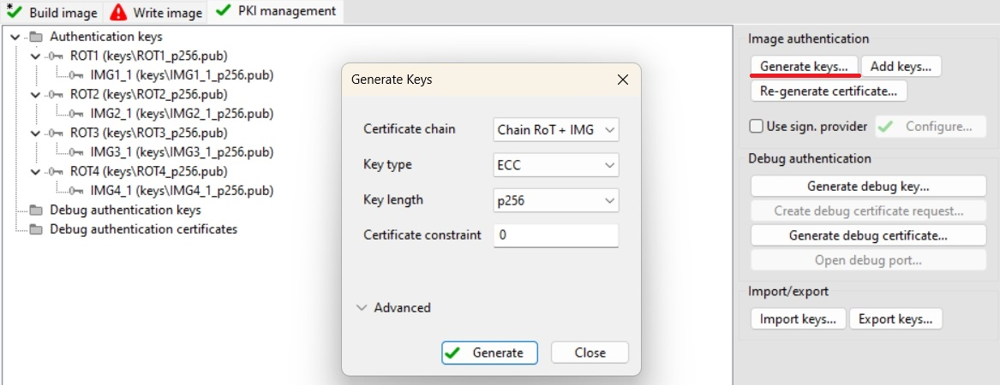
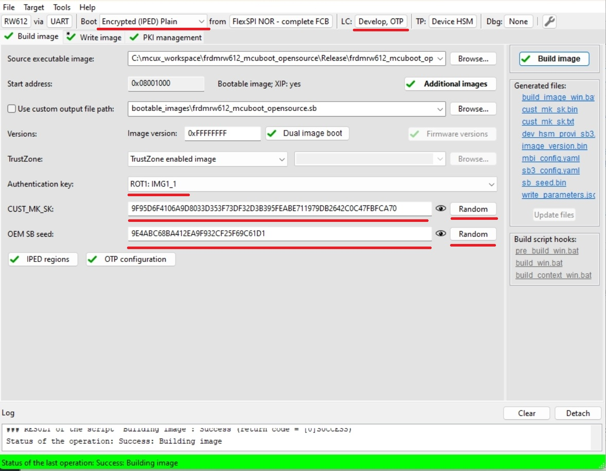
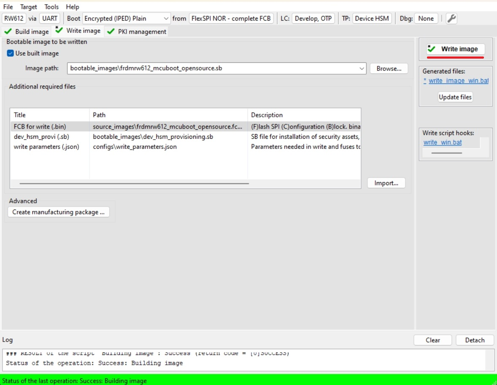
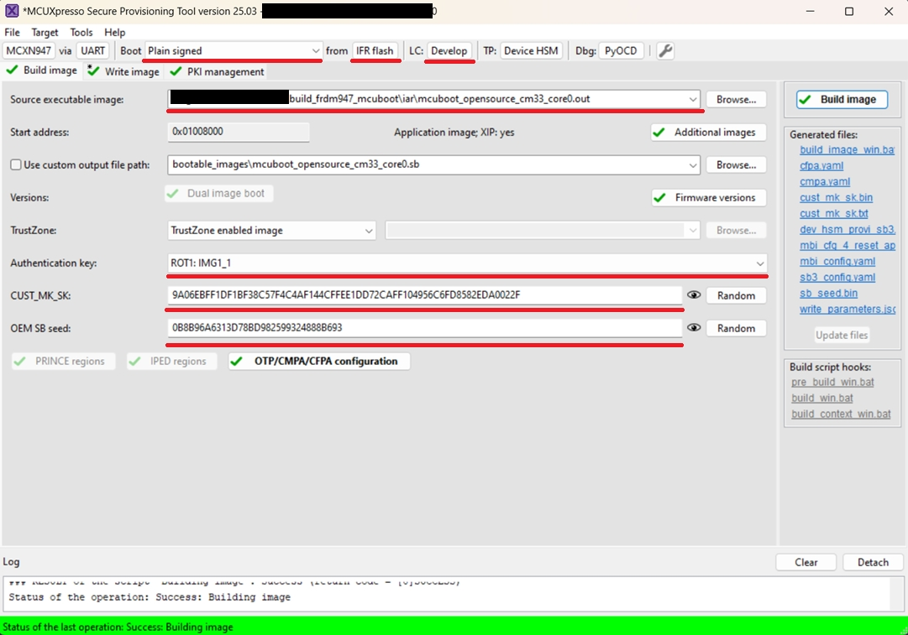
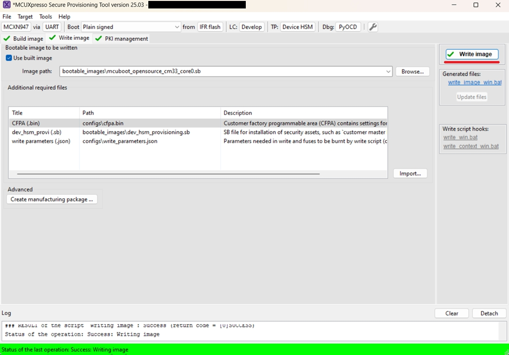
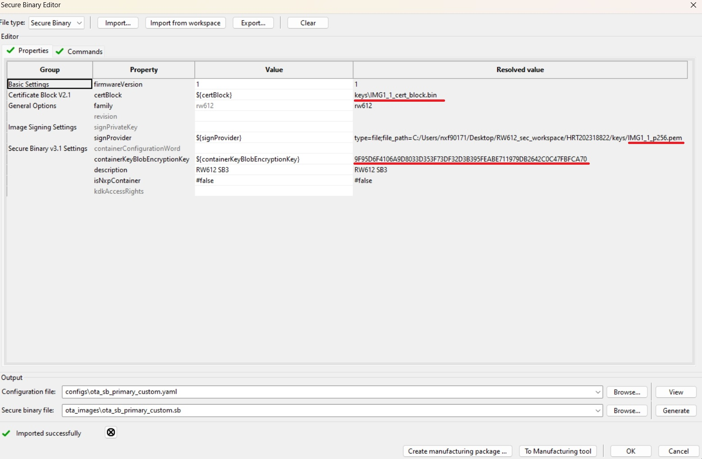
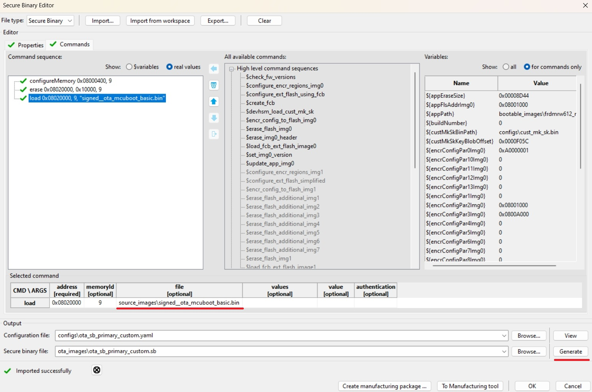

# MCUboot and OTA update by using SB3 file

   * [Risks and flash remapping functionality](#risks-and-flash-remapping-functionality)
- [Step-by-step demonstration](#step-by-step-demonstration)
   * [1. Provision the device and download the bootloader](#1-provision-the-device-and-download-the-bootloader)
      + [1.1 RW61x](#11-rw61x)
      + [1.2 MCXN](#12-mcxn)
   * [2. Prepare the binary image](#2-prepare-the-binary-image)
   * [3. Firmware update](#3-firmware-update)
- [Supported Boards](#supported-boards)

The [secure binary (SB)](https://spsdk-try.readthedocs.io/en/stable/images/secure_update.html) container in version 3.1 provides an alternative way to encapsulate the mcuboot image. This provides a secure and easy way to use hardware security features of a device to securely transport an OTA update regardless security of transport channel.

For demonstration purpose `ota_mcuboot_basic` demo for selected boards provides additional command `xmodem_sb3` to receive and process the SB3 file.

## Risks and flash remapping functionality

For more information, please read [Flash remapping functionality](flash_remap_readme.md).

Several NXP devices has flash remapping enabled by default, however, there are few things to keep in mind when using SB3 as an OTA update.

User has to ensure that the downloaded SB3 has correct load address targeting currently inactive image slot because an active application has no control over ROM IAP handling SB3. This creates a risk with overwriting active slot leading to bricked device if an incorrect SB3 is downloaded and no backup image is present in the inactive slot to recover.

__That means two separate SB3 files has to be generated if flash remap based on overlay is used and the application has to distinguish these two binaries during an OTA update. In case of flash remap based on swap mechanism the SB3 is always generated for secondary slot.__

# Step-by-step demonstration

In this walkthrough, if possible, the lifecycle of device is not changed for development purpose, so the device can be restored to its initial state. In real scenarios, transition the chips to the corresponding lifecycle is based on the requirements.

## 1. Provision the device and download the bootloader

The device must be provisioned to support SB3 processing. To simplify the workflow, the MCUXpresso Secure Provisioning Tool (SEC tool) is used.

To provision the device and download the bootloader, open the SEC tool, select target device and perform the following steps:

1. Erase the device
2. Build `mcuboot_opensource` project
3. Get the device into ISP mode - typically on development boards hold the ISP button and press the reset button
4. Open the SEC tool and create new workspace for target device
5. Select binary or linkable file of `mcuboot_opensource` as __Source executable image__
6. Switch to PKI management tab
    * Click __Generate keys__ (leave default settings)

Following steps depends on target device:

### 1.1 RW61x

RW61x doesn't properly support shadow registers to process SB3 files so the correct RKTH and CUST_MK_SK has to be provisioned. To provision these keys and keep the device in __Develop lifecycle__ we will initially use __Encrypted (IPED) Plain__ boot type. This initial operation provisions the device with RTKH and CUST_MK_SK permanently but the board will be still usable for development purpose. __User is advised to save SEC tool workspace (or atleast the keys) for future use__.

7. Build Image tab
    * Boot: __Encrypted (IPED) Plain__
    * Lifecycle: __Develop, OTP__
    * Select an __authentication key__ and generate __CUST_MK_SK__ and __OEM SB seed__
    * Click __Build image__

8. Write image tab
    * Click __Write image__

Now the device is provisioned without transition of the lifecycle.

9. Erase flash again and load unencrypted and unsigned `mcuboot_opensource` to the device using a programmer as usual

### 1.2 MCXN

7. Build Image 
    * Boot: Plain signed from IFR/Onchip flash based on `mcuboot_opensource` location
    * Lifecycle: Develop
    * Select an authentication key and generate CUST_MK_SK and OEM SB seed
    * Click __Build image__
    
8. Write image tab
    * Click __Write image__
    

## 2. Prepare OTA images

1. Build `ota_mcuboot_basic` and sign image by `imgtool` as usual by following steps in specific `example_board_readme.md` for your board. Copy the signed binary to your $sec_tool_workspace/source_images
2. Look into [cfg_templates](../sb3_api/cfg_templates) directory and copy SB3 configuration templates for your device to your $sec_tool_workspace/configs
    * RW61x: `sb3_config_rw612_primary_slot.yaml` for primary slot, `sb3_config_rw612_secondary_slot.yaml` for secondary slot
    * MCXN: `sb3_config_mcxn_secondary_slot.yaml`

__Note: As mentioned we have to generate two versions of SB3 file for primary and secondary slot if we use flash remapping feature based on overlay mechanism. This is not needed if your device has flash remap based on swap or mcuboot is configured to use swap/overwrite update mode - the SB3 file always loads payload to secondary (inactive) slot.__

3. In SEC tool open __Tools/SB Editor__ and click __Import__ to import SB3 configuration template for secondary(candidate) slot
    * Check and eventually fix paths to keys and image binary
    * click __Generate__

Following pictures are examples for RW61x device

4. (Devices with flash remap overlay) Repeat 3th step for primary slot

Note: Optionally, we can also create initial SB3 file containing initial (first) `ota_mcuboot_basic` application for primary/secondary slot (generated with additional __`--pad --confirm`__ imgtool arguments) to simulate manufacturing process, otherwise the initial signed image can be also loaded directly using ISP or other preferred method as usual.
    
## 3. Firmware update

For demonstration purpose we use [ExtraPutty](https://sourceforge.net/projects/extraputty/) tool as this fork of classic Putty has XMODEM support. Alternatively [TeraTerm](https://teratermproject.github.io/index-en.html) can be used.

1. Load and run initial `ota_mcuboot_basic` application as usual - alternatively load initial SB3 via `blhost` and `receive-sb-file` command.
    

2. Run `xmodem_sb3` command
    * Send a SB3 file via __Files Transfer/Xmodem (1k)__ 
    * (Devices with flash remap overlay) Make sure the selected SB3 targets inactive slot otherwise the device can be bricked
    * Mark written signed image as ready for install by `image test` command
    * Reboot

# Supported Boards

- [RD-RW612-BGA](../../_boards/rdrw612bga/ota_examples/mcuboot_opensource/example_board_readme.md)
- [FRDM-RW612](../../_boards/frdmrw612/ota_examples/mcuboot_opensource/example_board_readme.md)
- [FRDM-MCXN947](../../_boards/frdmmcxn947/ota_examples/mcuboot_opensource/example_board_readme.md)
- [MCX-N9XX-EVK](../../_boards/mcxn9xxevk/ota_examples/mcuboot_opensource/example_board_readme.md)