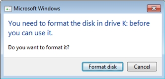
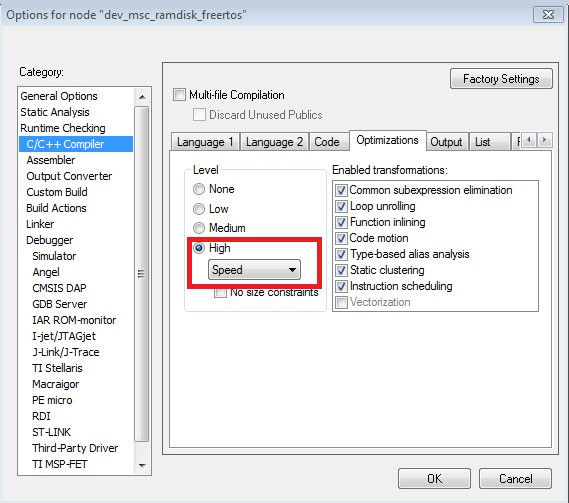
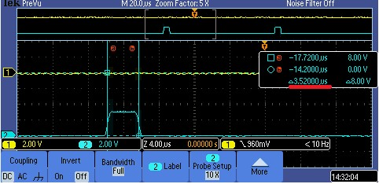

# dev_msc_ramdisk

## Overview

The USB MSC RAM disk application is a simple demonstration program based on the MCUXpresso SDK.
It is enumerated as a U-disk and can be read and written to as a normal U-disk .

## System Requirement

### Hardware requirements

- Mini/micro USB cable
- USB A to micro AB cable
- Hardware (Tower module/base board, and so on) for a specific device
- Personal Computer (PC)

### Software requirements

- The project files for lite version examples are located in: 
  <MCUXpresso_SDK_Install>/boards/<board>/usb_examples/usb_device_msc_ramdisk_lite/<rtos>/<toolchain>.
   For non-lite version example, the path is: 
  <MCUXpresso_SDK_Install>/boards/<board>/usb_examples/usb_device_msc_ramdisk/<rtos>/<toolchain>.
> The <rtos> is Bare Metal or FreeRTOS OS.

## Getting Started

### Hardware Settings

> Set the hardware jumpers (Tower system/base module) to default settings.

### Prepare the example

1.  Download the program to the target board.
2.  Connect the target board to the external power source (the example is self-powered).
3.  Power off the target board. And then power on again.
4.  Connect a USB cable between the PC and the USB device port of the board.

> For detailed instructions, see the appropriate board User's Guide.

## Run the example

1.  Plug in the MSD disk device, which is running the usb_device_msc_ramdisk example into PC. A USB Mass Storage Device is enumerated in the Device Manager.
2.  If you enable the RAM disk function, the windows prompts to format the u-disk.
 
When the format is completed, the computer will display the capacity of 4k removable disk.
 
note 
- For bulk out endpoint in high speed mode, maybe there are many Ping packets and NAK packets on USB bus, they will affect the bulk out throughput. To improve the throughput of the bulk out endpoint of high speed, provide one macro named as USB_DEVICE_IP3511HS_BULK_OUT_ONE_TIME_TRANSFER_SIZE_MAX for IP3511HS. The bigger this macro's value is, the higher throughput bulk out endpoint has. However, you need to set a reasonable value for this macro based on USB RAM size of Soc. If this macro's value is too big, link may be failed. Note that please set this value as integral multiple of 512U. The default vaule of this macro is 0U.
- Mac&reg; OS 10.9 default creates .fseventsd, .Trashes folder, and some other files the disk is formatted on Mac OS. The total file size is about 8 K.
If the USB mass storage example is running on Mac, increase the RAM size to at least 32 K.
Change the MACRO TOTAL_LOGICAL_ADDRESS_BLOCKS_NORMAL in disk.h from 48 to 64.
If the Mac OS 10.11 EI Capitan  is used to format the disk, the least ram size should be 2.1 MByte.
Otherwise, Mac OS shows "not enough space for allocate" and can't format the disk.
- The throughput of the FreeRTOS example may be lower than the bare metal example when using the KHCI (full speed controller) on some types of PCs.
    The root cause of the issue is that OUT tokens are sent too quickly on some types of PCs so that the receiving buffer on the device side can't be
    prepared in time. The detail analysis is in the subsequent chapter.
 The throughput of freertos example may be improved through adjusting the code optimizations of IAR. The setting method is shown in the below figure:
    In IAR, setting Option->C/C++ Compiler->Optimizations. 
 
    The reason that the device does not prepare the receiving buffer in time is explained as the following (the following measurement is done on the TWR-K65 module):
  GPIO Pulling up means: the previous token done interrupt received
  GPIO Pulling down means: the next data receiving buffer is primed.
  1. In the bare metal example, the time between GPIO pulling up and down is about 3.2 us. 
 
  2. In the FreeRTOS example, it is about 4 us.
 
        It takes longer to prime the buffer in the FreeRTOS example, when the Host sends OUT a token too fast and the receiving data buffer might not be ready yet,
    which causes NAKs during the data transfer. After a NAK occurs, becauses there is no ping control in the USB 1.1, the host has to send out the data (64 bytes) 
    packet before the NAK packet is received. On the full speed bus, this 64 bytes data packet consumes ~45 us. The 45 us delay is the root cause that the throughput on 
    the FreeRTOS drops.
  For some hosts, the interval between the previous transaction and next is a little longer, for example 7 us, which is enough time for the device to prepare the next receiving
    buffer and no NAK occurs. As a result, the throughput is higher.
  3. After adjusting the optimization, the time is about 3.6 us.
 
    Therefore, NAK number can be reduced during and the throughput can be increased during the transfer.

*/

## Supported Boards
- MIMXRT1170-EVKB
- FRDM-K22F
- LPCXpresso55S69
- EVK-MIMXRT1064
- MIMXRT685-AUD-EVK
- FRDM-MCXA276
- LPCXpresso51U68
- LPCXpresso54S018
- [LPCXpresso55S16](../../_boards/lpcxpresso55s16/usb_examples/usb_device_msc_ramdisk/example_board_readme.md)
- LPCXpresso54S018M
- MIMXRT1060-EVKB
- EVK-MIMXRT1010
- MIMXRT1040-EVK
- FRDM-MCXN947
- MIMXRT1024-EVK
- LPCXpresso55S28
- LPCXpresso54628
- LPCXpresso55S36
- MCX-N5XX-EVK
- MIMXRT1060-EVKC
- MIMXRT1160-EVK
- MIMXRT1180-EVK
- [FRDM-K32L2A4S](../../_boards/frdmk32l2a4s/usb_examples/usb_device_msc_ramdisk/example_board_readme.md)
- EVK-MIMXRT1020
- MIMXRT700-EVK
- FRDM-MCXA156
- EVK-MIMXRT595
- EVK-MIMXRT685
- MCX-N9XX-EVK
- EVKB-IMXRT1050
- RD-RW612-BGA
- FRDM-K32L3A6
- EVK-MIMXRT1015
- FRDM-MCXN236
- FRDM-RW612
